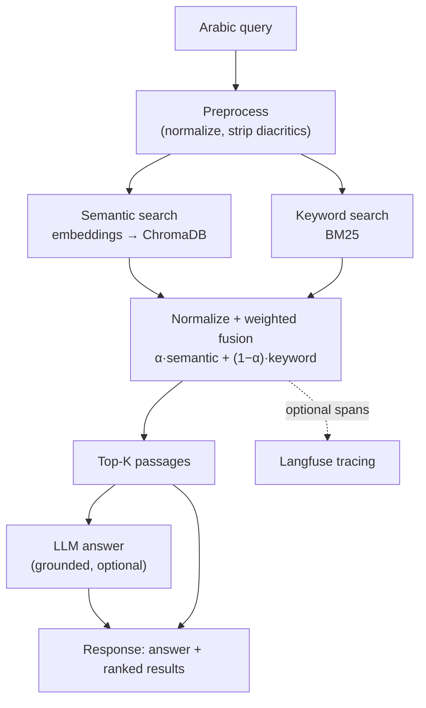

# باحث — Bahith

Arabic-first semantic search that combines Arabic-optimized embeddings, hybrid
retrieval, and grounded LLM answers, for developers building Arabic search over
their own documents.

[](https://github.com/SanaAraj/bahith-search/actions/workflows/ci.yml)
[](LICENSE)
[](pyproject.toml)

> **Live demo:** _pending deployment to Hugging Face Spaces_ — see [Roadmap](#roadmap).

## Why this exists

Most search stacks are built for English and mishandle Arabic: diacritics,
letter-form variants (أ/إ/آ/ا, ة/ه, ى/ي), and right-to-left rendering all
degrade recall. Bahith addresses this with proper Arabic normalization, an
Arabic-tuned embedding model, and BM25 keyword matching fused into a single
ranking — plus optional LLM answers grounded in the retrieved passages.

## Results

Measured on the bundled 12-document offline corpus. All numbers are
reproducible via the linked scripts; see
[Evaluation methodology](#evaluation-methodology) for the setup.

### Retrieval quality — [`eval/run_eval.py`](eval/run_eval.py)

| Metric | Value | Queries | Embedding model | Date |
|---|---|---|---|---|
| recall@5 | 1.00 | 28 | Arabic-Triplet-Matryoshka-V2 | 2026-07-03 |
| MRR | 1.00 | 28 | Arabic-Triplet-Matryoshka-V2 | 2026-07-03 |

> **Honest caveat:** on this small, topically-distinct corpus the eval is
> **saturated** — every query maps to one obvious document, so a working system
> scores 1.00. Treat this as "retrieval is wired correctly," **not** as a
> quality benchmark. Making it discriminative (a larger corpus with confusable
> topics and multi-relevant queries) is tracked in
> [`eval/DATASET.md`](eval/DATASET.md) and the [Roadmap](#roadmap).

### Latency — [`benchmark.py`](benchmark.py)

Darwin arm64, CPU only, 28 queries × 10 iterations, 2026-07-03.

| Path | p50 | p95 |
|---|---|---|
| Keyword (BM25) | 0.03 ms | 0.04 ms |
| Semantic (embed + vector) | 48.2 ms | 69.0 ms |
| Hybrid | 49.6 ms | 69.6 ms |

### Answer generation (LLM) — cost & latency

| Metric | Value |
|---|---|
| p50 / p95 latency | TBD |
| Cost per query | TBD |

TBD until run with an `OPENAI_API_KEY` set — `benchmark.py` measures and prices
this path from token usage automatically. It is unmeasured here rather than
estimated.

## Architecture



## Quickstart

Requires Python 3.11+.

```bash
git clone https://github.com/SanaAraj/bahith-search.git
cd bahith-search

python -m venv .venv && source .venv/bin/activate
pip install -r requirements.txt

# Seed the offline Arabic corpus and build both indices (one command).
python build_index.py --offline

# Optional: enable LLM answers (retrieval works without this).
cp .env.example .env   # then add your OPENAI_API_KEY

python main.py         # serves on http://localhost:8000
```

Or with Docker (index baked into the image, queryable on first boot):

```bash
docker compose up --build   # http://localhost:8000
```

## Usage examples

### HTTP API

```bash
curl -s http://localhost:8000/search \
  -H 'Content-Type: application/json' \
  -d '{"query": "ما هي عاصمة السعودية ورؤية 2030", "mode": "hybrid", "top_k": 3}'
```

Real ranked output (hybrid mode, Arabic-Triplet-Matryoshka-V2):

```
[1.000] المملكة العربية السعودية   (المملكة_العربية_السعودية.txt)
[0.288] الطاقة المتجددة            (الطاقة_المتجددة.txt)
[0.134] كرة القدم                 (كرة_القدم.txt)
```

The correct document is retrieved with a wide margin over unrelated topics.
With `OPENAI_API_KEY` set, the response also includes a grounded Arabic
`answer` synthesized from the top passages, plus a confidence score and related
queries. (Capturing that answer output requires a key; it is not shown here to
avoid publishing an unverified example.)

### Search modes

| Mode | Arabic | Best for |
|---|---|---|
| `hybrid` | هجين | Default — semantic understanding + exact matches |
| `semantic` | بحث دلالي | Conceptual matches with different wording |
| `keyword` | بحث كلمات | Exact phrases and names |
| `web` | ويب | Live web results (best-effort scraping) |

## Evaluation methodology

- **Corpus:** 12 Modern Standard Arabic documents, deterministically seeded via
  `build_index.py --offline` (no network), so runs reproduce exactly.
- **Queries:** 28 fixed queries in [`eval/dataset.json`](eval/dataset.json) —
  24 MSA and 4 dialectal (Gulf/Egyptian) — each labeled with the document(s)
  judged relevant. Relevance is document-level: a document counts as retrieved
  if any of its chunks appears in the ranked list.
- **Metrics:** mean recall@5 and MRR ([`eval/metrics.py`](eval/metrics.py),
  unit-tested).
- **Determinism:** retrieval has no sampling; reports record the embedding
  model id and a UTC timestamp. Full design notes and the saturation caveat are
  in [`eval/DATASET.md`](eval/DATASET.md).
- **CI gate:** every PR runs the eval and fails if recall@5 or MRR drops below
  threshold.

## Limitations

- **The eval is saturated** (see Results). It is a regression floor today, not a
  quality benchmark, until the corpus grows.
- **Small bundled corpus** (12 docs). It demonstrates the pipeline; it is not a
  broad knowledge base.
- **CPU latency** (~50 ms hybrid p50) is dominated by embedding inference and is
  hardware-dependent; a GPU or a smaller Matryoshka dimension would cut it.
- **Web mode scrapes DuckDuckGo HTML**, which is brittle and can break without
  notice; it is best-effort, not a supported retrieval path.
- **LLM answer quality** depends on the configured model and is only as good as
  the retrieved context; answers can still be wrong.
- **Embedding model fallback:** if the primary Arabic model can't be fetched,
  the app falls back to a generic multilingual model (lower Arabic quality) and
  logs a warning.

## Roadmap

- Expand the eval corpus to ~30–50 docs with confusable topics and
  multi-relevant queries so recall@5/MRR become discriminative.
- Measure and publish the LLM answer-path latency and per-query cost.
- Deploy the live demo to Hugging Face Spaces and link it above.
- Replace DuckDuckGo scraping with a supported search API for `web` mode.
- Add a re-ranking stage (cross-encoder) and tune the hybrid α on real queries.

## License

[MIT](LICENSE)
